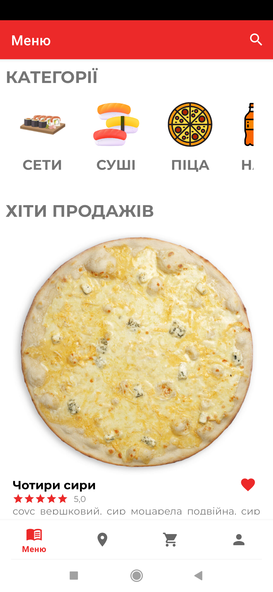
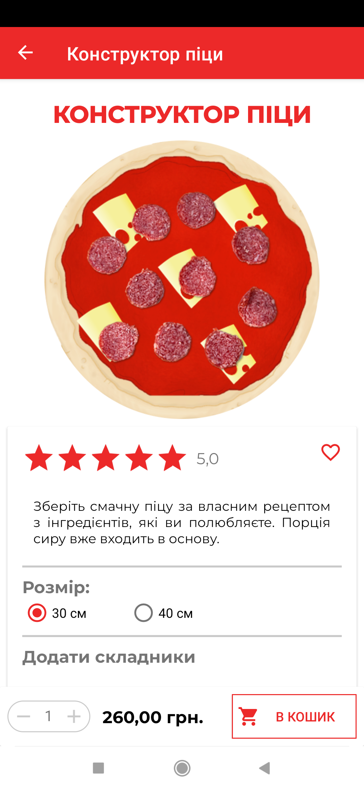
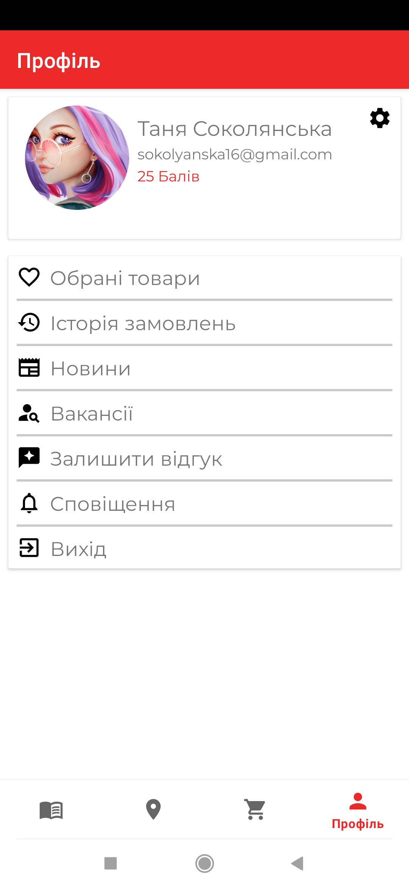

# PizzaDream (Client App)

An Android application for ordering pizza, developed as a **Bachelor's Thesis project (2024)**.
The app allows users to browse the menu, customize pizzas, place orders, and track their status in real-time.

> **Note:** This is an academic project designed to demonstrate skills in Native Android Development (Kotlin) and Clean Architecture principles.

## Features

* **Menu & Customization:** Browse categories, view product details, and create your own pizza using the "Custom Pizza Builder".
* **Order System:** Add items to cart, place orders, and track order status (Pending, Shipped, etc.).
* **User Account:** Registration, Login, Profile management, and Order History.
* **Social:** Read news, view vacancies, and send resumes directly from the app.
* **Locations:** View pizzeria locations on the map.
* **Favorites:** Save favorite items for quick access.

## Tech Stack

* **Language:** Kotlin
* **Architecture:** MVVM (Model-View-ViewModel)
* **UI:** XML Layouts, Material Design
* **Backend / Cloud:** Firebase (Auth, Realtime Database, Cloud Storage, Cloud Messaging)
* **Local Data:** Room Database (for Cart and Favorites)
* **Network:** Retrofit, Google Maps API
* **Async:** Coroutines, LiveData

## 📸 Screenshots

| Menu | Builder (Step 1) | Builder (Step 2) | Cart | Profile |
|:---:|:---:|:---:|:---:|:---:|
|  |  |  |  |  |

## Author

**Tetiana Sokolianska**
*Dnipro National University*
